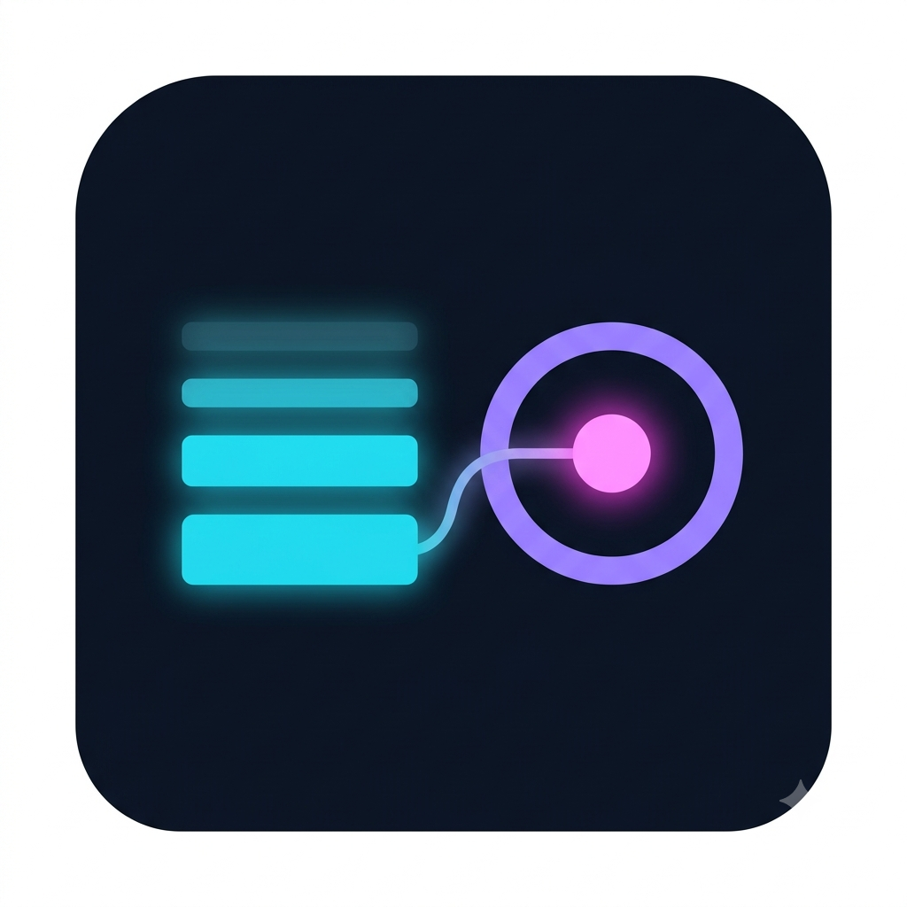

# 🧠 BDH vs. KV Caching — Synaptic Short-Term Memory Simulator

<p align="center"></p>

> **DataForge 2026 · Pathway Track — Post-Transformer Frontiers**
> An interactive educational sandbox that compares how a **Standard Transformer** (with its KV Cache) and **Pathway's Dragon Hatchling (BDH)** architecture each solve the problem of *how an AI remembers what it has already processed*.

**Live site:** [https://horizonxdev.github.io/cache-vs-hatch/](https://horizonxdev.github.io/cache-vs-hatch/)

---

## Table of Contents

- [The One-Sentence Pitch](#the-one-sentence-pitch)
- [Project Overview](#project-overview)
- [The Science Behind the Demo](#the-science-behind-the-demo)
- [Central Hypothesis](#central-hypothesis)
- [Key Features](#key-features)
- [Website Tour — Every Section Explained](#website-tour--every-section-explained)
  - [Global Elements](#global-elements)
  - [Part 1: The Simple Story (Landing Page)](#part-1-the-simple-story-landing-page)
  - [Part 2: The Technical Lab](#part-2-the-technical-lab)
- [The Math Engine](#the-math-engine)
- [Technology Stack](#technology-stack)
- [Project Structure](#project-structure)
- [Getting Started](#getting-started)
- [Available Scripts](#available-scripts)
- [Deployment to GitHub Pages](#deployment-to-github-pages)
- [Theme System (Dark / Light / Auto)](#theme-system-dark--light--auto)
- [Academic Honesty & Toy-Model Disclosure](#academic-honesty--toy-model-disclosure)
- [References](#references)
- [Built For](#built-for)

---

## The One-Sentence Pitch

**AI memory has one core problem: it grows forever, or it slowly forgets.** This project is an interactive, 100% client-side educational simulator that lets you *see* both sides of that trade-off — the Transformer's perfect-but-ever-growing KV cache versus BDH's fixed-size-but-fading synaptic memory — with real numbers you can change yourself.

---

## Project Overview

Every generative AI (chatbot, code assistant, agent) keeps a running memory of the context it has already processed. Two designs solve that memory problem in fundamentally different ways:

| | **Standard Transformer (KV Cache)** | **Pathway Dragon Hatchling (BDH)** |
|---|---|---|
| **How it stores memory** | A growing notebook: every token appends its Key (K) and Value (V) vectors to tables | A fixed "piano": each token re-tunes a constant-sized D×D synaptic weight matrix |
| **Memory footprint** | Linear — `O(N·D)` grows with sequence length | Constant — `O(D²)` regardless of sequence length |
| **Recall quality** | ~100% perfect recall (nothing is ever discarded) | Older tokens gradually fade via decay (λ) and interference |
| **The catch** | GPU VRAM overflow at long contexts (the "KV Cache Memory Wall") | Gentle forgetting of old information |

The website explains these concepts twice: first as a **simple, story-driven explainer** with no background needed, then as a **full technical lab** exposing the actual matrices, memory math, 3D visualization, a 1-million-token stress test, and cited theory.

> ⚠️ **Important:** The BDH simulation in this app is a *simplified teaching reimplementation* of BDH's Hebbian fast-weight mechanism, built from scratch — not Pathway's official BDH model or codebase. See the [Academic Honesty section](#academic-honesty--toy-model-disclosure).

---

## The Science Behind the Demo

The demo builds on these core concepts, each of which is explained interactively inside the app:

1. **Transformer** — A neural-network architecture that processes sequences with attention mechanisms; the foundation of modern LLMs (ChatGPT, Llama, etc.).
2. **Token** — A unit of text (a word, sub-word, or piece of punctuation) that a language model processes. The simulator uses playful emoji tokens (🍎 Apple, 🍌 Banana, 🐱 Cat, …) so the mechanics are intuitive.
3. **Autoregressive generation** — Producing a sequence one token at a time, using previously generated tokens as context.
4. **Self-attention** — How a model determines which tokens in a sequence are relevant to each other (via Query, Key, Value).
5. **KV Cache** — A Transformer inference technique that *stores* previously computed Key/Value representations so they can be reused for every subsequent generated token instead of being recomputed. The cache grows linearly with the sequence length — that is the "memory wall."
6. **Dragon Hatchling (BDH)** — Pathway's post-Transformer architecture family that replaces the growing KV tables with a **fixed-size fast-weight associative memory**. Each new token performs a **Hebbian outer-product write** into the same weight matrix:

   ```
   W_t = λ · W_(t-1) + k_t · v_tᵀ
   ```

   Retrieval is then a single matrix-vector product: `v_retrieved = W_t · ϕ(q_t)`.

7. **Sparsity** — BDH's activation vectors are **sparse and non-negative** (only ~5% of units fire for any given key), which reduces interference between memories and is GPU-friendly.
8. **The trade-off** — A perfect memory that grows forever vs. a small fixed memory that slowly forgets. Neither is free; the app shows both sides honestly.

---

## Central Hypothesis

> *"A standard Transformer requires a Key-Value (KV) cache that scales linearly O(N) with sequence length to maintain perfect recall, whereas a Synaptic-Memory recurrent model like Dragon Hatchling (BDH) maintains a fixed-size O(1) state footprint but experiences gradual recall decay (interference) as sequence length grows."*

This hypothesis is stated prominently in the header's collapsible **Lesson Curriculum & Objectives** panel and demonstrated throughout the simulator.

---

## Key Features

- 🎬 **60-second animated explainer** — five words stream in, side by side: a growing "notebook" (Transformer) vs. a fixed 4×4 "synaptic brain grid" (BDH).
- 🎛️ **Fully interactive simulator** — adjust sequence length (N), synaptic decay (λ), and vector dimension (D); regenerate random vectors; apply preset scenarios with one click.
- 📊 **Head-to-head dashboard** — live-computed GPU memory footprint, per-token read cost, cited sparsity claims, and recall/interference metrics.
- 🧮 **Real matrix visualizers** — the KV cache's K/V tables and BDH's D×D synaptic weight heatmap, computed live in the browser.
- 🔍 **Interactive test bench** — click any historical token and compare each model's retrieved vector against the ground truth.
- 📈 **Recall decay curve** — an SVG chart plotting recall accuracy vs. token position for both architectures.
- 🧊 **3D animated simulator** — a real-time canvas-rendered 3D scene (KV "tower" growing block by block vs. a fixed rotating neural mesh) with energy particles streaming tokens into both models.
- 🔥 **Extreme stress simulator** — drag N from 1K to 1M tokens and watch the Transformer's VRAM blow past 80 GB while BDH stays flat.
- 🎓 **Guided lesson & theory tabs** — a beginner-friendly 4-step narrative plus a scientific section explaining how BDH differs from State-Space Models (SSMs) like Mamba.
- 🐣 **Step-by-step toy model** — walk token-by-token through both memory writes, inspecting key/value vectors and the evolving W matrix.
- ✅ **3-question quiz with confetti** — an interactive knowledge check with instant feedback and a celebration when all three are answered.
- 🌗 **Theme system** — System / Light / Dark modes with smooth transitions and a full light-theme CSS audit.

---

## Website Tour — Every Section Explained

### Global Elements

#### `HeaderBanner` — Sticky top header
- **Badges:** "DataForge 2026 Pathway Track" and "Post-Transformer Frontiers".
- **Title:** "BDH vs. KV Caching: Synaptic Short-Term Memory" with a gradient accent.
- **Lesson Curriculum & Objectives button** — expands a collapsible panel containing:
  - **Target Audience** — Data Scientists, AI Engineers, LLM Systems Researchers, and Computational Neuroscientists.
  - **Core Learning Objectives** — visualize linear O(N) VRAM growth in KV caches, understand the Hebbian write rule `W_t = λ·W_(t-1) + k_t·v_tᵀ`, observe ~5% sparse activations, and analyze the exact-recall vs. fixed-O(1)-state trade-off.
  - **Recommended Prerequisites** — linear algebra, Q/K/V attention intuition, and fast-weight associative memory concepts.
  - **Central Hypothesis** highlight box.
- **Theme toggle** (System / Light / Dark).

#### Toy Reimplementation Disclosure Banner
A persistent amber banner directly under the header — required for hackathon honesty — explaining that this app is a from-scratch teaching reimplementation of BDH's Hebbian fast-weight mechanism and *not* Pathway's actual BDH model. Real BDH adds details not modeled here (sparse activation gating, GPU-friendly formulation, scale-free graph structure), and cited Pathway figures are labeled as reported.

#### Footer
- "DataForge 2026 Pathway Track Submission"
- "🚀 Developed by Team Horizon ✨" (animated footer credit)
- "Pathway Post-Transformer Architecture Series (BDH)"

---

### Part 1: The Simple Story (Landing Page)

Rendered by **`LandingStory`** — designed for a first-time visitor with zero background.

#### 1. Hero section
- Tagline: *"AI memory has one core problem: it grows forever, or it slowly forgets."*
- **Three intuition cards:**
  - 📒 *The Transformer writes everything down* — the "notebook that grows" (KV cache).
  - 🧠 *BDH re-tunes one fixed memory* — the "piano with fixed strings".
  - ⚖️ *That's the whole trade-off* — perfect-but-growing vs. small-but-fading.
- **CTAs:** "Watch it happen with 5 words ↓" (scrolls to the animation) and "Skip to the technical lab".

#### 2. Animated demo — `AnimatedMemoryFlow`
A self-contained, auto-playing animation (Play/Pause/Restart controls, clickable token strip):
- **Transformer side:** a stack of "Notebook Pages" that grows taller with every word — a particle packet is visibly "sent to Page #N".
- **BDH side:** a fixed **4×4 brain grid** of synapse units that never changes size — only ~5% light up with a glowing pulse ("Lighting up ~5% brain synapses...").
- A footnote honestly notes these are simplified visuals; the lab shows the real numbers.

#### 3. Takeaways section
- Two key takeaways: (1) memory size scalability, (2) remembering older tokens.
- An amber "honest bottom line" box: *"So which is better? It depends."*
- Final CTA: **"Open the technical lab: full controls & real numbers"** — described as *"Matrices, memory math, 3D animation, a 1-million-word stress test, and cited theory."*

---

### Part 2: The Technical Lab

Opened from the landing page; managed by **`App.tsx`** with four tabs:

| Tab | Icon | Contents |
|---|---|---|
| **Interactive simulator** | ⚙️ CPU | Controls, head-to-head dashboard, both model panels, test bench, decay curve |
| **3D animations** | 📦 Box | Real-time 3D memory simulator |
| **Extreme scale — up to 1M words** | 🔥 Flame | VRAM stress test |
| **Theory, lesson & quiz** | 📖 Book | Guided lesson, step-by-step toy model, metaphors + quiz |

All numbers in the lab are **computed live in the browser** from seeded random vectors — nothing is hardcoded.

#### Tab 1: Interactive Simulator

**`ControlsBar`** — the master controls:
- **Sequence Length (N)** slider: 5–100 tokens.
- **Synaptic Decay (λ)** slider: 0.80 (fast forgetting) → 1.00 (infinite retention).
- **Vector Dimension (D)** selector: 4×4, 8×8, or 16×16.
- **Regenerate Random Vectors** button (new seed).
- **Preset Scenarios:** Default Benchmark (N=20, λ=0.95, D=8) · Memory Bottleneck (N=100) · High Interference (λ=0.82) · High Dimension (D=16).

**`VictoryDashboard`** — "Head-to-Head: What Each Approach Costs" (explicitly *"computed live + cited — not a scoreboard"*):
- 💾 **GPU Memory Footprint** — BDH's fixed D×D state (O(1)) vs. the KV cache's N×D tables, in formatted bytes with savings %.
- ⚡ **Per-Token Retrieval Cost** — `D²` ops for BDH vs. ≈`2·N·D + N` for the KV cache.
- 🩺 **Sparse, Positive Activations** — the cited Pathway claim (arXiv link + GitHub link).
- ⚠️ **Interference & Memory Decay** — live recall bars for the KV cache (~100%) vs. BDH (decayed), plus signal trace `λ^age` and interference magnitude.
- A **Sources & method** footnote citing the BDH paper.

**`PanelTransformer`** (cyan) — "Standard Transformer (KV Cache)":
- Live **Key Matrix [K]** and **Value Matrix [V]** visualizers (N×D grids; the active token and high-attention cells glow).
- **Live VRAM Memory Calculator** with LLM presets (Toy Educational Model, Llama 3 8B, Llama 3 70B): computes `VRAM = 2 × layers × heads × dim × N × bytes`.
- Amber **Memory Bottleneck Warning** about KV caches exceeding tens of GB at 100K+ tokens.

**`PanelBDH`** (pink/emerald) — "Pathway Dragon Hatchling (BDH)":
- **Fixed Fast-Weight Matrix [W_t ∈ ℝ^(D×D)]** heatmap — positive weights in pink, negative in blue, ~5% active units pulsing with glow. Size never changes with N.
- **Sparse Non-Negative Activation Renderer** — per-token `ReLU(k_t − θ)` firing state, showing the ~5% target.
- **State Matrix Footprint** — fixed bytes, "Growth with Length N: 0 Bytes (Constant O(1))".
- Emerald **Bounded O(1) Memory Footprint** callout.
- Note: the badge "ARCHITECTURAL WINNER" reflects the memory-footprint comparison, while the dashboard keeps the honest caveat about recall decay.

**`TestBench`** — "Interactive Test Bench (Ground Truth vs. Model Estimate)":
- A horizontally scrollable strip of all sequence tokens; click any to query both models.
- **Ground Truth Target [v_target]** · **Transformer KV Cache Recall** · **BDH Synaptic Recall (W·q)** — three side-by-side vector cards with recall % bars, plus decay factor and interference readouts for BDH.

**`RecallDecayCurve`** — "Analytical Recall Decay Curve vs Token Position":
- An interactive SVG chart (100%-flat cyan line for the Transformer vs. a pink decay curve for BDH), with hoverable/clickable data points, gradient area fills, and a live readout card showing `Transformer % / BDH % / λ^age`.

#### Tab 2: 3D Animations

**`Model3DSimulator`** — a real-time **canvas-based 3D scene** (HiDPI-aware, custom 2.5D projection — no WebGL required):
- A central "word capsule" fires glowing **energy particles** toward both models.
- **Transformer:** a 3D stack of cuboid "pages" that grows taller each step, turning red as it approaches overflow.
- **BDH:** a fixed **16-node rotating 3D neural mesh** with synaptic beams; only ~5% of nodes pulse at a time.
- Play/Pause/Reset controls; auto-advances every 2.5s through 6 tokens.

#### Tab 3: Extreme Scale — Stress Simulator

**`StressSimulator`** — models a Llama-3-70B-scale configuration (80 layers, 64 heads, dim 128, FP16):
- Slider from **N = 1,000 to 1,000,000 tokens** with quick presets (1K / 50K / 200K / 500K / 1M).
- **Transformer card:** required VRAM computed as `2 × L × H × D × N × 2B`; the card turns red and pulses **"💥 GPU VRAM OVERFLOW!"** past the 80 GB threshold, with a decode-speed readout that degrades with N.
- **BDH card:** fixed ~50 MB footprint and a constant 250 tokens/sec, labeled "🟢 WINNER: FIXED O(1)".

#### Tab 4: Theory, Lesson & Quiz

**`GuidedLesson`** — two tabs:

*The Guided Narrative (Beginner Friendly)* — 4 steps with Previous/Next navigation:
1. **The Notebook Analogy** — why Standard Transformers run out of memory (KV Cache Memory Wall).
2. **The Piano String Analogy** — how BDH's Hebbian synapses work (`W_t = λ·W_(t-1) + k_t·v_tᵀ`).
3. **Why ~5% Sparse Activations Prevent Confusion** — biological sparsity.
4. **Summary: The Great AI Trade-Off** — side-by-side comparison card.

*Scientific Theory & BDH vs. SSMs*:
1. **Is BDH a State-Space Model (SSM) like Mamba?** — No; BDH is a post-Transformer architecture using fast-weight associative synaptic matrices, not continuous linear-time-invariant dynamics.
2. **Linear Attention via Hebbian Outer-Product Dynamics** — why softmax blocks factorization, and how BDH converts attention into linear outer-product updates.
3. **Key Research Takeaway** — bounded O(1) fast-weight state storage unlocks infinite sequence streaming.

**`StepByStepToyModel`** — "Step-by-Step Memory Write Simulator":
- A **5-token, D=4** toy model with step 0 (empty state) → step 5.
- Player controls: reset, previous, auto-play, next, and "New Vectors" (new seed).
- For each step: the incoming token's **Key vector** and **Value vector**, the Transformer's growing **[K] table** ("Rows Stored: n / 5"), and BDH's **fixed 4×4 W matrix** with active sparse units highlighted.
- A "What just happened?" explanation banner narrates each step.

**`Class10Explainer`** — metaphors + quiz:
- **Metaphor 1:** The Heavy Backpack (Transformer) vs. The Brain (BDH).
- **Metaphor 2:** The 100 Light Switches (~5% sparsity).
- **Interactive AI Knowledge Challenge** — 3 multiple-choice questions with instant right/wrong feedback and explanations, a live **Score: n / 3 Stars ⭐️** counter, and a **confetti celebration** when all three are answered.

---

## The Math Engine

All simulation logic lives in **`src/utils/mathEngine.ts`** — pure TypeScript, no dependencies:

| Function | Purpose |
|---|---|
| `generateRandomUnitVector(dim)` | Random normalized vector of dimension D |
| `generateTokenSequence(N, D)` | N tokens with emoji labels and random K/V vectors |
| `computeTransformerKVCache(tokens)` | Explicit N×D Key and Value tables (the KV cache) |
| `computeBDHSynapticMatrix(tokens, λ, D)` | Hebbian fast-weight matrix: `W_t = λ·W_(t-1) + k_t·v_tᵀ`, plus sparse activations (`ReLU(k − θ)`) and ~5% active node indices |
| `computeToyModelStepHistory(tokens, λ, D)` | Per-step history for the step-by-step toy model |
| `dotProduct` / `cosineSimilarity` | Vector math for retrieval scoring |
| `queryModels(tokens, idx, …)` | Retrieves a target token's value with both architectures; returns attention weights, recall accuracies, decay factor `λ^age`, and interference magnitude |
| `formatBytes(bytes)` | Human-readable B/KB/MB/GB formatting |

**How retrieval works:**
- **Transformer:** softmax attention over all stored keys (`softmax(Q·Kᵀ/√d) · V`) → near-100% cosine-similarity recall because every key/value is stored uncompressed.
- **BDH:** a single matrix-vector product `v = W_t · q` → recall that decays with the token's age (`λ^age`) and suffers interference from overlapping key vectors.

**How memory math works:**
- KV cache bytes ≈ `2 · layers · heads · dim · N · bytesPerElement` (grows with N).
- BDH state bytes ≈ `layers · dim² · bytesPerElement` (constant, independent of N).

Type definitions live in **`src/types/simulation.ts`** (`SimulationToken`, `TransformerState`, `BDHState`, `RetrievalResult`, `ToyStepState`, `LLMModelPreset` + `LLM_PRESETS`).

---

## Technology Stack

| Layer | Technology |
|---|---|
| **Frontend** | React 19 + TypeScript + Vite |
| **Styling** | Tailwind CSS 4 (via `@tailwindcss/vite`), custom CSS design tokens |
| **Animation** | Framer Motion 13 (UI transitions), custom Canvas 2D 3D rendering |
| **Icons** | Lucide React |
| **Celebration** | canvas-confetti |
| **3D** | Hand-rolled Canvas 2D projection (HiDPI-aware) — no WebGL dependency |
| **Backend** | None — 100% client-side SPA (no server, API, or database) |
| **Fonts** | Plus Jakarta Sans (UI) + JetBrains Mono (data) via Google Fonts |
| **Linting** | Oxlint (`.oxlintrc.json`) |
| **Deployment** | GitHub Pages via GitHub Actions (`.github/workflows/deploy.yml`) |

---

## Project Structure

```
├── index.html                     # Entry HTML (fonts, title, root div)
├── package.json                   # Scripts & dependencies
├── vite.config.ts                 # Vite config (base: '/cache-vs-hatch/')
├── .github/workflows/deploy.yml   # CI: build + publish to GitHub Pages
├── public/
│   ├── favicon.svg                # Site favicon
│   └── icons.svg                  # Icon sprite
└── src/
    ├── main.tsx                   # React entry point
    ├── App.tsx                    # Root component: state, lab tabs, layout, footer
    ├── index.css                  # Tailwind import, fonts, glow/shimmer animations
    ├── types/
    │   └── simulation.ts          # TypeScript interfaces + LLM presets
    ├── utils/
    │   └── mathEngine.ts          # The entire simulation math (pure functions)
    ├── styles/
    │   ├── darkTheme.css          # Default dark "synaptic lab" theme tokens
    │   └── lightTheme.css         # Full light-mode override audit
    └── components/
        ├── HeaderBanner.tsx        # Sticky header + curriculum info panel
        ├── ThemeToggle.tsx         # System / Light / Dark switcher
        ├── LandingStory.tsx        # Story-driven landing page
        ├── AnimatedMemoryFlow.tsx  # 5-word animated explainer
        ├── ControlsBar.tsx         # N / λ / D sliders + presets
        ├── VictoryDashboard.tsx    # Head-to-head cost comparison
        ├── PanelTransformer.tsx    # KV cache matrices + VRAM calculator
        ├── PanelBDH.tsx            # BDH weight matrix + sparse activations
        ├── TestBench.tsx           # Ground-truth vs. model retrieval test
        ├── RecallDecayCurve.tsx    # SVG recall decay chart
        ├── Model3DSimulator.tsx    # Real-time 3D scene (Canvas 2D)
        ├── StressSimulator.tsx     # 1K–1M token VRAM stress test
        ├── GuidedLesson.tsx        # 4-step narrative + SSM theory tab
        ├── StepByStepToyModel.tsx  # Token-by-token memory write player
        └── Class10Explainer.tsx    # Metaphors + 3-question quiz
```

---

## Getting Started

**Prerequisites:** Node.js ≥ 20 (the CI pipeline uses Node 22).

```bash
# 1. Install dependencies
npm install

# 2. Start the dev server (http://localhost:5173)
npm run dev

# 3. Type-check + production build
npm run build

# 4. Preview the production build locally
npm run preview

# 5. Lint
npm run lint
```

> Note: `vite.config.ts` sets `base: '/cache-vs-hatch/'` because this is a GitHub Pages **project site** served under a sub-path. If the repo is renamed, update `base` to match.

---

## Available Scripts

| Script | Description |
|---|---|
| `npm run dev` | Start the Vite dev server with HMR |
| `npm run build` | Type-check (`tsc -b`) then build to `dist/` |
| `npm run preview` | Serve the built `dist/` locally |
| `npm run lint` | Run Oxlint with the React/TypeScript rules |

---

## Deployment to GitHub Pages

The repo ships a GitHub Actions workflow (`.github/workflows/deploy.yml`) that:

1. Checks out the code, installs dependencies (`npm ci`), and builds (`npm run build`).
2. Uploads `dist/` as a Pages artifact.
3. Publishes it to GitHub Pages.

It triggers **on every push to `master`** and can also be run manually via **Actions → Run workflow**.

**One-time setup on GitHub:**
1. Push the repo to GitHub (branch `master`).
2. Open **Settings → Pages** and set **Source** to **GitHub Actions**.
3. Push anything to `master` (or run the workflow manually) — the site goes live at `https://horizonxdev.github.io/cache-vs-hatch/`.

---

## Theme System (Dark / Light / Auto)

The **`ThemeToggle`** cycles through three modes: **System (Auto) → Light → Dark** (persisted in `localStorage` under `df-theme`).

- **Dark (default)** — the "cybernetic synaptic AI laboratory" look: near-black slate backgrounds with cyan/pink/purple meshes, defined in `src/styles/darkTheme.css`.
- **Light** — a fully audited high-contrast academic/lab palette that overrides the dark slate classes (cards, borders, typography, badges, progress bars, even the header) via `html.light` rules in `src/styles/lightTheme.css`.
- **System** — follows the OS `prefers-color-scheme` and live-updates on OS changes.
- Smooth cross-fades are enabled by a temporary `theme-switching` class on the `<html>` element.

The 3D canvas scene also reads the active theme to render light-appropriate colors.

---

## Academic Honesty & Toy-Model Disclosure

This submission complies with the hackathon rule that toy models must be clearly identified:

- The app contains a **persistent amber disclosure banner** stating that it is a simplified teaching reimplementation of BDH's Hebbian fast-weight mechanism (`W_t = λ·W_(t-1) + k·vᵀ`), built from scratch for DataForge 2026 — **not** Pathway's actual BDH model or codebase.
- Real BDH includes additional architectural details **not modeled here** (e.g., sparse activation gating, GPU-friendly formulation, scale-free graph structure).
- Where the app cites Pathway figures (e.g., "activation vectors of BDH are sparse and positive," "GPU-friendly formulation"), they are **labeled as reported** and linked to their sources.
- The "ARCHITECTURAL WINNER" / "🟢 WINNER" labels refer specifically to the *memory-footprint* comparison; the dashboard and recall curve surface BDH's forgetting trade-off just as prominently.

---

## References

- **Pathway BDH paper:** A. Kosowski et al., *The Dragon Hatchling: The Missing Link between the Transformer and Models of the Brain* (2025) — [arXiv:2509.26507](https://arxiv.org/abs/2509.26507)
- **Pathway BDH repository:** [github.com/pathwaycom/bdh](https://github.com/pathwaycom/bdh)
- Background: Transformer KV-caching inference techniques and State-Space Models (Mamba/S4) as discussed in the in-app Theory tab.

---

## Built For

- **Data Scientists & AI Engineers** wanting an intuition for KV cache memory walls and fast-weight alternatives.
- **LLM Systems Researchers** exploring context scaling beyond transformer KV memory limits.
- **Computational Neuroscientists** interested in synaptic (Hebbian) memory formulations.
- **Students & educators** who want a visual, interactive way to learn about Transformer-based AI memory — no equations required to start, full math available when you're ready.

---

*Built with React, TypeScript, Tailwind CSS, Framer Motion & Lucide Icons. Pure 100% client-side simulation — every number you see is computed live in your browser.*
